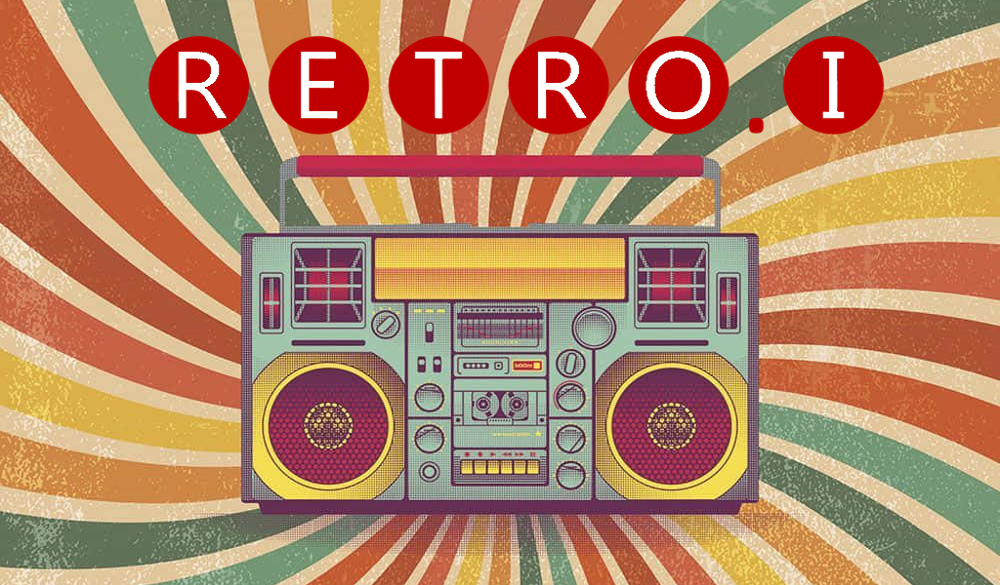

# Retro.I

  &nbsp;
  &nbsp;
  &nbsp;
  &nbsp;

Ein Projekt der Klasse "FWI1" des BSZ-Wiesau\
Einem **Grundig Type 5088**, Baujahr **1957/1958**, wird neues Leben eingehaucht!\

## Dokumentation
Für die Dokumentation wurde sich die Arbeit gemacht eine eigene Seite zu erstellen.

Diese ist unter https://docs.retroi.de zu erreichen!

Diese durchaus sehenswerte Seite enthält alles Wissen, welches sich im Laufe der Zeit über den Radio angesammelt hat. \
Wirf daher gerne einen Blick darauf! \
Außerdem sind hier Features, Setup, etc. beschrieben und können dort nachgelesen werden. 

Viel Spaß beim Stöbern ;)

## Setup
Für das Setup existiert eine eigene [Doku-Seite](https://docs.retroi.de/setup/). \
Hier kann alles nötige und Wissenswerte rund um das Aufsetzen der Software nachgelesen werden.

## Bedienung
Auch für die Bedienung existiert eine [Doku-Seite](https://docs.retroi.de/user-manual/).
Hier sind alle nötigen Infos für die Bedienung der Software nachzulesen.
